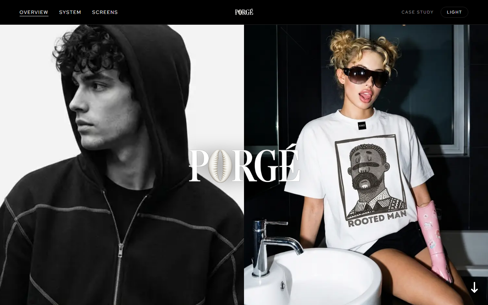
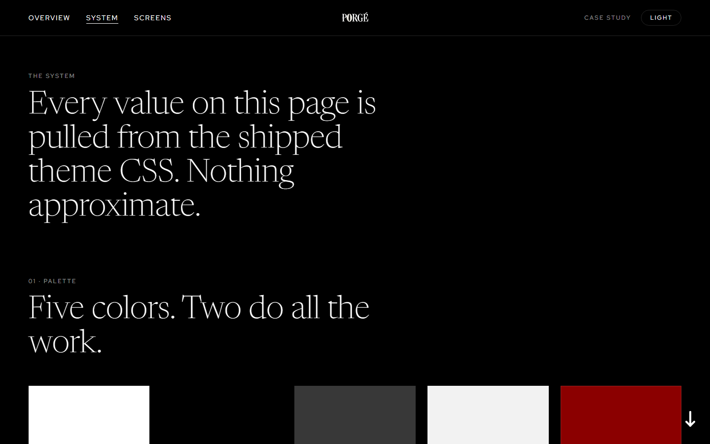
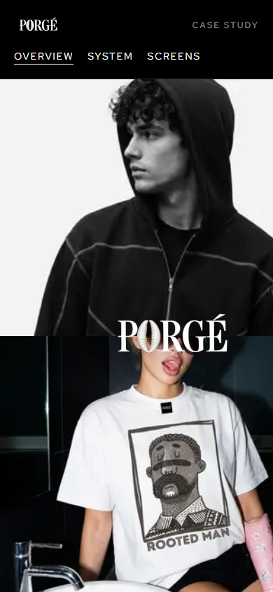

# PORGÉ — a storefront, redesigned

**Live case study → [porge.vercel.app](https://porge.vercel.app)**

PORGÉ is a UK streetwear label built on African heritage: cowries, coral beads, heavyweight fabric. The founder hired me to set up their Shopify store. The existing storefront was working against the brand, so I also rebuilt the front end on the Atelier theme, section by section.

The store itself is still private and pre-launch. This repo is the case study that stands in for it: a small Next.js site that walks through the brief, the design decisions, the design system, and every page of the shipped store.



## My role

| | |
|---|---|
| **Role** | Design, front-end build, store setup |
| **Platform** | Shopify (Atelier theme, reworked) |
| **Status** | Private, pre-launch |

## What's in the case study

- **Overview** (`/`): the brief, then three design decisions ("strokes"): the split hero, the quiet categories section, and the campaign showcase.
- **System** (`/system`): the palette, type and shape language, using values taken directly from the shipped theme CSS.
- **Screens** (`/screens`): 14 captures of the real store (landing, store, product and info pages), each captioned with the reason behind it.



## Built with

- **Next.js 14** (App Router) and React 18. No UI library; all styling is hand-written CSS.
- **Self-hosted fonts** (Newsreader and Red Hat Text) via `next/font/local`.
- **Dark/light theme**: an inline script reads the saved choice before first paint, so the page doesn't flash the wrong theme.
- **Custom scroll-arrow scrollbar** (`components/Scrollbar`): an animated arrow that eases between poses as you scroll, rendered with difference blending so it stays visible on light and dark sections.
- `next/image` for all photography, with explicit `sizes` and priority loading on the hero.

<p align="center"></p>

## Run locally

```bash
npm install
npm run dev
```

Open http://localhost:3000.

## Credits

Brand, photography and products © PORGÉ. Case study design and code by [Kingsley Aremu](https://kingsleyaremu.vercel.app).
